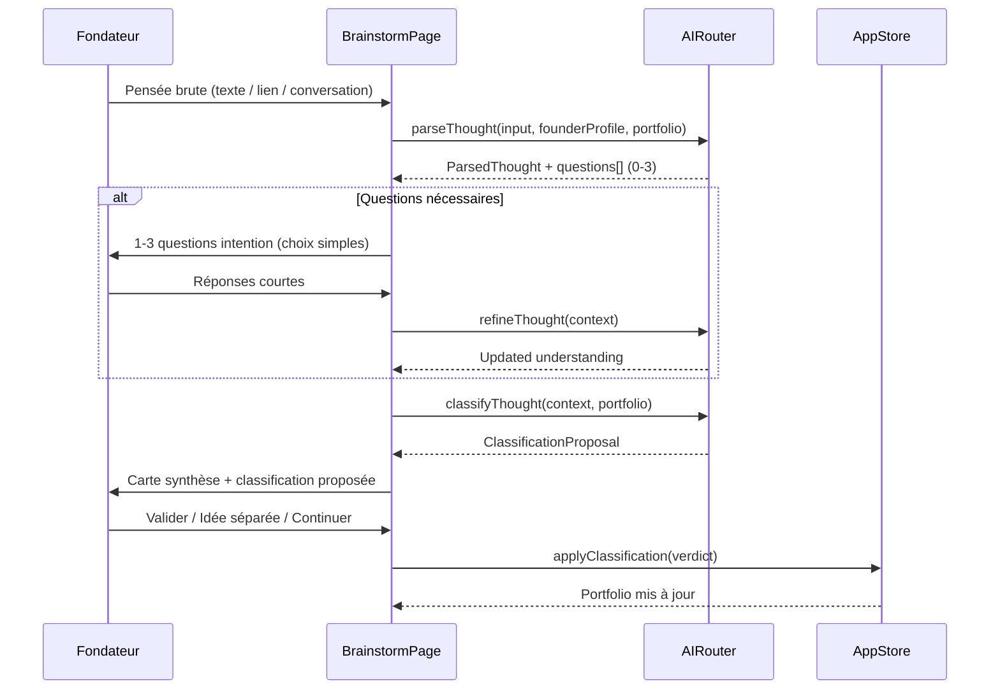

# NextStep Idea OS — Pivot AI Brainstorm Design Spec

**Date:** 2026-06-17  
**Status:** Approved (conversation validated)  
**One-liner:** Un outil où tu parles, l'AI écoute, relie et organise — pour que tes projets cessent d'être une liste et deviennent un système.

---

## 1. Contexte & diagnostic

### État actuel (v0)

| Aspect | Aujourd'hui |
|--------|-------------|
| Stack | Vite + React 19 + TypeScript + Tailwind v4 + Zustand + Firebase Auth |
| Persistance | `localStorage` (`nextstep-idea-os-v1`) — Firestore repo stub non implémenté |
| Création idée | Formulaire lourd : titre → edit avec 15+ champs + 11 sliders manuels |
| Scoring | Profils « Freedom First », etc. = **lentilles de lecture**, pas profil fondateur |
| Navigation | Dashboard kanban, Ideas board, Synergy, Umbrellas, Review, Profiles |
| AI | Aucune couche AI, aucun onboarding fondateur |

### Vision cible

| Pilier | Rôle |
|--------|------|
| **Brainstorm libre** | Point d'entrée — « Qu'est-ce qui te traverse l'esprit ? » |
| **Questions d'intention** | Affinent sans micro-management business (1–3 max par tour) |
| **Classification portfolio** | Relier, regrouper, mutualiser (nouveau / extension / variante / socle) |
| **Profil fondateur** | Contexte pour interpréter et prioriser |
| **Clés API BYOK** | OpenAI / Anthropic / Gemini / Perplexity — jamais côté serveur |
| **Portfolio vivant** | Vision claire qui émerge au fil des sessions |

### Décisions produit verrouillées

| Question | Choix |
|----------|-------|
| Priorité v1 | **(C)** Onboarding fondateur (3 blocs) + première analyse AI à la création |
| Providers | **(B)** Multi-provider recommandé — Perplexity marché, LLM analyse |
| Flux post-classification | **(C) puis (A)** — dialogue d'abord, proposition explicite à valider ensuite |
| Architecture clés | **BYOK** — localStorage chiffré, jamais Firestore |
| Relay CORS | Optionnel pour Anthropic — relay Firebase stateless (header forwardé, pas de log) |

---

## 2. Architecture applicative

### 2.1 Nouvelle structure des routes

```
/app
├── /brainstorm          ← PAGE D'ACCUEIL (flux du moment) — remplace dashboard comme index
├── /portfolio           ← Vue système (idées + liens AI + umbrellas + socles)
├── /ideas/:id           ← Fiche enrichie par l'AI (scores AI, pas sliders vides)
├── /founder             ← Profil fondateur (onboarding + édition)
├── /settings            ← Clés API BYOK + préférences provider
└── /review              ← Synthèse hebdo AI-assisted (existant, enrichi)

Routes conservées (secondaires) :
├── /ideas               ← Board kanban (accessible, plus le CTA principal)
├── /synergy, /umbrellas, /filters  ← Conservés, enrichis par AI plus tard
```

**Redirect :** `/app` → `/app/brainstorm` (ou brainstorm comme `index` route).

### 2.2 Diagramme de flux — Brainstorm



### 2.3 Couches logicielles

```
src/
├── types/
│   ├── domain.ts              ← Étendu (FounderProfile, BrainstormSession, etc.)
│   └── ai.ts                  ← Types AI router, providers, tâches
├── features/
│   ├── founder/               ← Onboarding 3 blocs + page profil
│   ├── brainstorm/            ← Flux conversation → proposition → validation
│   ├── portfolio/             ← Vue système (graphe / clusters)
│   ├── settings/              ← BYOK keys + provider prefs
│   └── ai/
│       ├── router.ts          ← Route tâche → provider
│       ├── providers/         ← openai, anthropic, gemini, perplexity
│       ├── prompts/           ← Templates par tâche
│       ├── keyStorage.ts      ← Chiffrement localStorage
│       └── schemas.ts         ← JSON schemas pour structured output
├── services/
│   └── firebase/
│       └── relay.ts           ← Optionnel — proxy CORS stateless
└── app/
    ├── store.ts               ← Étendu (founderProfile, brainstormSessions, aiSettings)
    └── persistence.ts         ← v2 key + migration
```

---

## 3. Modèles de données

### 3.1 FounderProfile

Profil structuré issu de 3 blocs texte libre (onboarding ~5 min).

```typescript
type FounderProfile = WithTimestamps & {
  id: string
  userId: string

  // Bloc 1 — Qui je suis (texte brut + structuré)
  whoIAmRaw: string
  whoIAm: {
    experienceSummary: string
    skills: string[]
    location?: string
    timeConstraints?: string
  }

  // Bloc 2 — Ce que je veux
  whatIWantRaw: string
  whatIWant: {
    lifestyleVision: string
    revenueTarget?: string
    autonomyVsSalary: 'autonomy' | 'salary' | 'balanced' | 'unknown'
    horizonYears?: number
  }

  // Bloc 3 — Comment je fonctionne
  howIWorkRaw: string
  howIWork: {
    personalitySummary: string
    riskTolerance: 'low' | 'medium' | 'high' | 'unknown'
    energyDrivers: string[]
    energyDrains: string[]
  }

  onboardingCompletedAt?: FirestoreTime
  lastStructuredAt?: FirestoreTime  // dernière structuration AI
}
```

**Règles :**
- L'utilisateur remplit 3 textareas guidés (pas 50 champs).
- L'AI structure en JSON interne si clé configurée ; sinon structuration minimale côté client (paragraphes conservés, champs structurés vides).
- Édition en 1 clic : re-voir les 3 blocs + JSON structuré corrigeable.

### 3.2 AI Settings (BYOK — local uniquement)

```typescript
type AIProvider = 'openai' | 'anthropic' | 'google' | 'perplexity'

type AIProviderConfig = {
  apiKey: string           // chiffré au repos
  enabled: boolean
  lastTestedAt?: number
  lastTestStatus?: 'ok' | 'error'
}

type AITaskRole =
  | 'structureProfile'    // Structurer profil fondateur
  | 'parseThought'        // Parser pensée brute
  | 'refineThought'       // Questions + affinage
  | 'classifyPortfolio'   // Classification portfolio
  | 'analyzeIdea'         // Brief + scores dimensionnels
  | 'marketResearch'      // Marché / tendances / concurrence
  | 'portfolioScan'       // Synergies / thèmes communs

type AISettings = {
  providers: Partial<Record<AIProvider, AIProviderConfig>>
  defaultAnalysisProvider: AIProvider
  taskRouting: Partial<Record<AITaskRole, AIProvider>>
  persistKeys: boolean     // false = session only
}
```

**Stockage :** `localStorage` clé `nextstep-ai-settings-v1`, chiffrement AES-GCM via Web Crypto API (clé dérivée du `userId` Firebase — pas de secret serveur).

**Règle absolue :** Jamais dans Firestore, jamais dans le repo, jamais loggée côté relay.

### 3.3 BrainstormSession

```typescript
type BrainstormPhase =
  | 'input'           // Pensée brute soumise
  | 'clarifying'      // 1-3 questions en cours
  | 'proposing'       // Carte synthèse affichée
  | 'applied'         // Classification validée
  | 'cancelled'

type PortfolioVerdict =
  | 'new'             // Nouvelle entrée distincte
  | 'extension'       // Extension d'une idée existante
  | 'variant'         // Variante proche — fusion/umbrella envisageable
  | 'sharedBase'      // Socle mutualisé détecté

type ClarifyingQuestion = {
  id: string
  text: string
  dimension: 'intention' | 'problem' | 'proximity' | 'maturity' | 'energy'
  options: { id: string; label: string }[]
  allowFreeText: boolean
}

type ClassificationProposal = {
  provisionalTitle: string
  understoodSummary: string
  verdict: PortfolioVerdict
  targetIdeaId?: string          // pour extension / variante
  targetUmbrellaId?: string
  alternativeVerdict?: PortfolioVerdict
  alternativeNote?: string
  founderFitNote?: string        // langage naturel, pas sliders
  energyNote?: string
  confidence: 'low' | 'medium' | 'high'
}

type BrainstormSession = WithTimestamps & {
  id: string
  phase: BrainstormPhase
  rawInput: string
  inspirations?: IdeaInspiration[]
  questions: ClarifyingQuestion[]
  answers: Record<string, string>
  proposal?: ClassificationProposal
  resultIdeaId?: string
  resultLinkId?: string          // SynergyLink ou IdeaExtension créé
}
```

### 3.4 Extensions au modèle Idea existant

Le type `Idea` actuel est conservé pour compatibilité. Ajouts :

```typescript
// Champs ajoutés à Idea
type Idea = ... & {
  // ... existant ...

  /** Source du scoring */
  scoreSource: 'manual' | 'ai' | 'hybrid'
  aiAnalysis?: {
    analyzedAt: FirestoreTime
    provider: AIProvider
    brief: string
    founderFitNote: string
    whyNow?: string
    audience?: string
    risks?: string
    dimensionScores?: Partial<Record<ScoreDimension, number>>
  }

  /** Lien portfolio AI */
  portfolioRole?: 'standalone' | 'extension' | 'variant'
  parentIdeaId?: string          // si extension
  extensionNote?: string         // ex. "nouveau canal WhatsApp"

  /** Métadonnées capture */
  captureSource: 'manual' | 'brainstorm'
  brainstormSessionId?: string
}
```

### 3.5 SharedBase (socle mutualisé)

```typescript
type SharedBase = WithTimestamps & {
  id: string
  name: string
  description: string
  ideaIds: string[]
  sharedDimensions: ('audience' | 'infra' | 'brand' | 'backOffice' | 'channels')[]
  aiSuggested: boolean
  confirmedByUser: boolean
}
```

### 3.6 Persistance — migration v1 → v2

```typescript
type AppDataV2 = AppData & {
  version: 2
  founderProfile: FounderProfile | null
  brainstormSessions: BrainstormSession[]
  sharedBases: SharedBase[]
  // aiSettings reste hors AppData — stockage séparé
}
```

**Migration :** `loadPersistedData()` détecte absence de `version`, ajoute champs vides, set `version: 2`.

---

## 4. AI Router & Providers

### 4.1 Routage par tâche (multi-provider B)

| Tâche | Provider par défaut | Fallback |
|-------|---------------------|----------|
| `structureProfile` | `defaultAnalysisProvider` | — |
| `parseThought` | `defaultAnalysisProvider` | — |
| `refineThought` | `defaultAnalysisProvider` | — |
| `classifyPortfolio` | `defaultAnalysisProvider` | — |
| `analyzeIdea` | `defaultAnalysisProvider` | — |
| `marketResearch` | `perplexity` (si clé) | `defaultAnalysisProvider` |
| `portfolioScan` | `defaultAnalysisProvider` | — |

L'utilisateur peut surcharger via `taskRouting` dans Settings (phase ultérieure — v1 utilise les défauts ci-dessus).

### 4.2 Interface AIRouter

```typescript
interface AIRouter {
  isAvailable(task: AITaskRole): boolean

  structureProfile(raw: FounderProfileInput): Promise<FounderProfileStructured>
  parseThought(input: ParseThoughtInput): Promise<ParseThoughtResult>
  refineThought(ctx: RefineContext): Promise<RefineResult>
  classifyPortfolio(ctx: ClassifyContext): Promise<ClassificationProposal>
  analyzeIdea(idea: Idea, profile: FounderProfile): Promise<IdeaAIAnalysis>
  marketResearch(query: string): Promise<MarketResearchResult>
  portfolioScan(ideas: Idea[], profile: FounderProfile): Promise<PortfolioScanResult>

  testConnection(provider: AIProvider): Promise<{ ok: boolean; error?: string }>
}
```

### 4.3 Structured output

Toutes les tâches AI retournent du JSON validé côté client via schemas Zod (à ajouter en dépendance) ou validation manuelle TypeScript.

Exemple `ClassificationProposal` — le prompt exige JSON strict, le router parse et valide avant affichage.

### 4.4 Gestion CORS

| Provider | Appel direct navigateur | Notes |
|----------|---------------------------|-------|
| OpenAI | ✅ Oui | `dangerouslyAllowBrowser` non requis — fetch standard |
| Google Gemini | ✅ Oui | `generativelanguage.googleapis.com` |
| Perplexity | ✅ Oui | API compatible OpenAI |
| Anthropic | ⚠️ Souvent bloqué | Relay optionnel |

**Relay Firebase (optionnel, phase 2+) :**

```
POST /api/ai-relay
Headers: Authorization: Bearer <user-api-key>
Body: { provider, endpoint, payload }
→ Forward stateless, pas de log, pas de stockage
```

Implémentation : Firebase Cloud Function minimal ou Vite proxy en dev uniquement pour v1.

### 4.5 Mode dégradé (sans clé API)

| Fonctionnalité | Sans clé |
|----------------|----------|
| Onboarding fondateur | ✅ 3 blocs texte, pas de structuration AI |
| Brainstorm | ✅ Capture texte → classification manuelle simplifiée (4 boutons verdict) |
| Analyse idée | ❌ Bandeau « Connecte une clé API » |
| Marché | ❌ |
| Portfolio scan | ❌ |

Bandeau global non-intrusif en haut de `/app/brainstorm` et `/app/settings`.

---

## 5. UX — Écrans clés

### 5.1 Onboarding fondateur (`/app/founder`)

**Déclenchement :** Premier login si `founderProfile.onboardingCompletedAt` absent → redirect après auth.

**UI :** 3 étapes (stepper léger), chaque étape = 1 textarea + prompt guide + exemple fantôme.

| Étape | Prompt guide |
|-------|--------------|
| Qui je suis | « Raconte ton parcours pro et ce que tu sais faire mieux que la moyenne » |
| Ce que je veux | « À quoi ressemble ta vie idéale dans 3 ans ? Quel type de revenu ? » |
| Comment je fonctionne | « Décris-toi en quelques phrases — forces, faiblesses, ce qui te motive » |

**Fin :** Si clé AI → structuration automatique + écran récap éditable. Sinon → sauvegarde texte brut, structuration vide.

### 5.2 Brainstorm (`/app/brainstorm`)

**Composants :**
- `ThoughtInput` — textarea large + bouton Partager + attache inspirations (lien, conversation)
- `ClarifyingDialog` — 1-3 questions, options radio + « Je ne sais pas encore »
- `ProposalCard` — synthèse + classification + actions Valider / Idée séparée / Continuer
- `DegradedBanner` — si pas de clé API

**Règle d'or des questions :** On clarifie la pensée, on ne construit pas le plan. Jamais CA, TAM, personas, stack.

### 5.3 Settings (`/app/settings`)

Par provider :
- Champ clé API (type password, masqué)
- Toggle activer
- Bouton « Tester la connexion » → indicateur ✓/✗
- Choix provider par défaut pour l'analyse
- Toggle « Utiliser Perplexity pour recherche marché » (si clé Perplexity)
- Checkbox « Ne pas persister les clés » (session only)
- Avertissement : « Ta clé reste sur cet appareil. Ne partage pas ton poste. »

### 5.4 Portfolio (`/app/portfolio`)

Remplace le dashboard comme vue système :
- Clusters d'idées liées (extension / variante)
- Umbrellas émergents (existants + AI-suggested)
- Socles mutualisés (`SharedBase`)
- Indicateurs : ce qui monte, ce qui se répète
- Liens vers fiches idée

v1 : liste groupée + liens visuels simples (pas de graphe force-directed — phase ultérieure).

### 5.5 Fiche idée (`/app/ideas/:id`)

- Brief AI pré-rempli (si analysé)
- Scores dimensionnels AI (remplace sliders en lecture ; édition manuelle optionnelle en « override »)
- Section « Fit fondateur » en langage naturel
- Inspirations (conservé)
- Lien parent/enfant si extension
- Profils de scoring = lentilles de lecture (conservé, onglet ou sidebar)

---

## 6. Prompts AI (principes)

### 6.1 System prompt commun

```
Tu es un collègue créatif qui aide un fondateur à clarifier ses idées.
Tu ne fais pas de business plan. Tu ne demandes jamais de CA, TAM, pricing, ou stack technique.
Tu poses 1 à 3 questions maximum par tour, avec des choix simples.
Tu acceptes "je ne sais pas encore" comme réponse valide.
Tu réponds en français sauf si l'utilisateur écrit en anglais.
```

### 6.2 Contexte injecté

Chaque appel inclut :
- `FounderProfile` structuré (ou brut si pas structuré)
- Liste idées existantes : `{ id, title, oneLiner, status, portfolioRole, parentIdeaId }`
- Umbrellas et SharedBases existants (titres + ids)

### 6.3 Classification — critères

| Verdict | Critère |
|---------|---------|
| `new` | Thème absent du portfolio |
| `extension` | Même idée, nouvel angle (marché, feature, canal) |
| `variant` | Proche d'une idée existante — fusion ou umbrella à envisager |
| `sharedBase` | Plusieurs idées partagent audience/infra/marque/back-office |

---

## 7. Ce qu'on garde / retire / cache

| Garde | Retire ou cache |
|-------|-----------------|
| Inspirations (liens, conversations) | 11 sliders manuels en création |
| Umbrellas & synergies (enrichis AI) | « Créer une idée » comme CTA principal |
| Profils de scoring = lentilles lecture | Formulaire edit lourd en step 2 obligatoire |
| Review hebdo | Board kanban comme écran principal |
| Type `Idea` existant (étendu) | Scores manuels par défaut à la création |

---

## 8. Sécurité

| Risque | Mitigation |
|--------|------------|
| Clé API exposée | BYOK local uniquement ; avertissement UI |
| Clé dans localStorage | Chiffrement AES-GCM Web Crypto |
| Relay Firebase | Stateless, pas de log, Authorization forwardé |
| Prompt injection via inspirations | Sanitize URLs ; limiter taille input ; system prompt robuste |
| Données profil fondateur | Firestore rules : `request.auth.uid == userId` (phase sync) |

---

## 9. Phases d'implémentation

### Phase 1 — Fondations (semaine 1)
- Types `FounderProfile`, `AISettings`, `BrainstormSession`, extensions `Idea`
- Migration persistance v2
- Page `/app/founder` onboarding 3 blocs (sans AI)
- Page `/app/settings` squelette
- Redirect `/app` → `/app/brainstorm`
- Nav mise à jour

### Phase 2 — BYOK + AI Router (semaine 2)
- `keyStorage.ts` chiffrement
- Providers OpenAI, Gemini, Perplexity (appels directs)
- `AIRouter` avec `structureProfile`, `parseThought`, `analyzeIdea`
- Settings fonctionnel : test connexion, routing
- Bandeau mode dégradé

### Phase 3 — Flux Brainstorm (semaine 3)
- Page `/app/brainstorm` complète
- `refineThought` + `classifyPortfolio`
- `ProposalCard` + application verdict au store
- Création idée depuis brainstorm (scores AI, pas sliders)

### Phase 4 — Portfolio & classification (semaine 4)
- Page `/app/portfolio`
- `SharedBase` + liens parent/enfant sur idées
- `portfolioScan` AI
- Enrichissement synergies/umbrellas suggérés

### Phase 5 — Marché & sync (semaine 5+)
- `marketResearch` via Perplexity
- Relay Anthropic optionnel
- Firestore sync multi-device (FounderProfile, Ideas, Sessions)
- Review hebdo AI-assisted

---

## 10. Critères de succès v1

1. Login → onboarding 3 blocs → profil sauvegardé en < 5 min
2. Settings → clé OpenAI testée ✓ en < 1 min
3. Brainstorm → pensée brute → 1-3 questions → proposition → validation → idée créée
4. Fiche idée affiche brief + scores AI sans sliders manuels
5. Portfolio montre au moins les liens extension/parent
6. Sans clé API : brainstorm fonctionne en mode manuel dégradé
7. Aucune clé API dans Firestore, git, ou logs

---

## 11. Hors scope v1

- Reconnaissance vocale
- Graphe interactif force-directed
- Relay Firebase (sauf si Anthropic bloquant en pratique)
- Sync Firestore multi-device (phase 5)
- Task routing granulaire par tâche dans Settings UI
- Tests automatisés E2E (tests unitaires router/schemas seulement)

---

## 12. Dépendances à ajouter

| Package | Usage |
|---------|-------|
| `zod` | Validation schemas AI output |
| (optionnel) `@anthropic-ai/sdk` | Si relay ou SDK préféré |

Pas de SDK OpenAI requis — `fetch` natif suffit pour v1.
